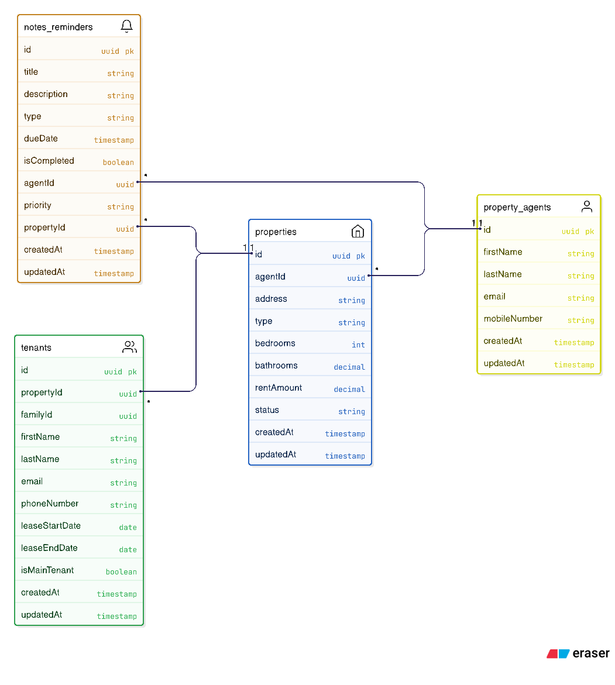

# Property Management System

A full-stack TypeScript application for managing property agents, rental properties, tenants, and maintenance reminders.

> **Assessment Test** - Created by Kevin Jan Barluado

## Overview

This application allows property agents to manage their rental properties, track tenants, and maintain notes/reminders for property-related tasks like maintenance and pest control.

## Architecture

- **Backend**: Express.js + TypeScript (REST API)
- **Frontend**: Vue 3 + Vite
- **Storage**: In-memory data store
- **API Documentation**: Swagger/OpenAPI 3.0
- **Deployment**: Docker with Node.js v22.20.0

## Data Model




**Entities:**
- **Property Agents** - Main entity managing properties
- **Properties** - Rental properties managed by agents
- **Tenants** - People renting properties (grouped by family)
- **Notes/Reminders** - Agent notes for property maintenance tasks

**Current Implementation:**
- Property Agent CRUD operations
- Property, Tenant, and Notes entities (schema defined, API pending)

## Quick Start

### Prerequisites
- Docker and Docker Compose
- OR Node.js v22.20.0+ (for local development)

### Using Docker (Recommended)

```bash
# Build and start all services
docker-compose up -d

# View logs
docker-compose logs -f

# Stop services
docker-compose down
```

**Access Points:**
- Frontend: http://localhost:8080
- API: http://localhost:3000
- API Documentation: http://localhost:3000/api-docs

### Local Development

#### Backend
```bash
cd server
npm install
npm run dev      # Development with hot reload
npm run build    # Build TypeScript
npm start        # Production mode
```

#### Frontend
```bash
cd client
npm install
npm run dev      # Development server
npm run build    # Production build
```

## API Endpoints

### Property Agents

| Method | Endpoint | Description |
|--------|----------|-------------|
| `GET` | `/api/agents` | Get all agents |
| `GET` | `/api/agents/:id` | Get agent by ID |
| `POST` | `/api/agents` | Create new agent |
| `PUT` | `/api/agents/:id` | Update agent |
| `DELETE` | `/api/agents/:id` | Delete agent |

### Request Examples

**Create Agent (Postman/curl):**
```bash
curl -X POST http://localhost:3000/api/agents \
  -H "Content-Type: application/json" \
  -d '{
    "firstName": "John",
    "lastName": "Doe",
    "email": "john.doe@example.com",
    "mobileNumber": "+1234567890"
  }'
```

**Get All Agents:**
```bash
curl http://localhost:3000/api/agents
```

**Get Single Agent:**
```bash
curl http://localhost:3000/api/agents/{agent-id}
```

**Delete Agent:**
```bash
curl -X DELETE http://localhost:3000/api/agents/{agent-id}
```

## Features

### Implemented
- Property Agent CRUD operations
- Input validation and sanitization
- Email uniqueness constraint
- Phone number format validation (international support)
- Automatic timestamps (createdAt, updatedAt)
- RESTful API with OpenAPI documentation
- Modern Vue 3 UI with Tailwind CSS
- Dockerized deployment

### Validation Rules
- **First Name / Last Name**: 1-50 characters, required
- **Email**: Valid email format, unique, max 100 characters
- **Mobile Number**: Min 10 digits, supports international formats
  - Examples: `+1234567890`, `(123) 456-7890`, `+44 20 1234 5678`

### Stretch Goal Improvement
**Enhanced Security & Data Integrity:**
- Input sanitization middleware to prevent XSS attacks
- Email uniqueness validation to prevent duplicate agents
- Comprehensive error handling with detailed validation messages
- Phone number format validation supporting international numbers
- Timestamps for audit trail (createdAt, updatedAt)

## Error Handling

**Backend (API Layer):**
- Input validation before processing
- Structured error responses with HTTP status codes
- Detailed validation error messages
- Duplicate detection (409 Conflict)

**Frontend (UI Layer):**
- HTML5 form validation for immediate feedback
- Pattern matching for phone numbers
- User-friendly error messages
- Loading states during API calls

**Error Response Format:**
```json
{
  "success": false,
  "error": "Validation failed",
  "message": "Please check your input data",
  "details": [
    "mobileNumber must be a valid phone number"
  ]
}
```

## Development Workflow

The application was built incrementally with meaningful commits:

1. **Foundation**: Basic Express + Vue setup
2. **Core Features**: Property Agent CRUD operations
3. **Validation**: Input validation and error handling
4. **UI/UX**: Frontend form and list view
5. **Documentation**: Swagger/OpenAPI integration
6. **Security**: Input sanitization and constraints
7. **DevOps**: Docker containerization

## Testing

**Manual Testing via Swagger UI:**
Visit http://localhost:3000/api-docs to test all API endpoints interactively.

**Using Postman/curl:**
Import the OpenAPI spec from http://localhost:3000/api-docs.json

## Docker Commands

```bash
# Rebuild after code changes
docker-compose up --build -d

# View container logs
docker-compose logs -f server
docker-compose logs -f client

# Reset everything
docker-compose down -v --rmi all

# Clean rebuild
docker-compose up --build -d
```

## Notes

- All data is stored in-memory and will be lost on server restart
- The application uses UUID v4 for agent IDs
- Timestamps are automatically managed by the system
- CORS is enabled for local development
